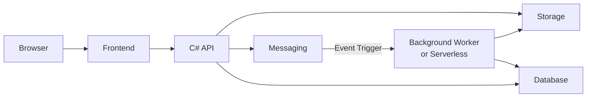

# Image Gallery
Practical implementation of image post-processing with cloud services integration.

# Architecture

## Storage Providers

| Storage         | Status         | Path |
|------------------|:------:|------|
| Azure Blob       | 
✅
     | [/Storage/Azure](src/Backend/Infrastructure/Storage/Azure)|
| Fake             | 
✅
     | [/Storage/Fake](src/Backend/Infrastructure/Storage/Fake) |

## Messaging Providers

| Messaging            | Status         | Path           |
|---------------------|:------:|----------------|
| Azure Queue Storage | 
✅
     | [/Messaging/AzureQueueStorage](src/Backend/Infrastructure/Messaging/AzureQueueStorage) |
| Fake                | 
✅
     | [/Messaging/Fake](src/Backend/Infrastructure/Messaging/Fake) |

