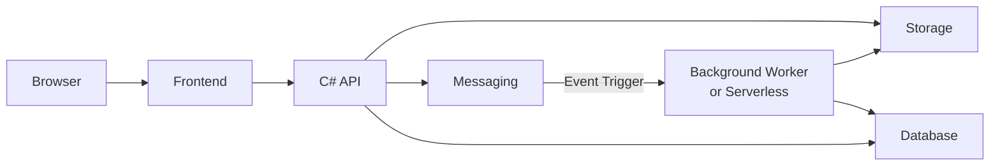

# Object Storage
Practical implementation messaging and storage with cloud services.

# Architecture


## Storage Providers

| Storage         | Status         | Path |
|------------------|:------:|------|
| Azure Blob Storage      | <center>✅</center>     | [/Storage/Azure](src/Backend/Infrastructure/Storage/Azure)|
| Azure File Share       | <center>❌</center>     | |
| Google Cloud Storage       | <center>❌</center>     | |
| Amazon S3       | <center>❌</center>     | |
| Fake             | <center>✅</center>     | [/Storage/Fake](src/Backend/Infrastructure/Storage/Fake) |

## Messaging Providers

| Messaging            | Status         | Path           |
|---------------------|:------:|----------------|
| Azure Queue Storage | <center>✅</center>     | [/Messaging/AzureQueueStorage](src/Backend/Infrastructure/Messaging/AzureQueueStorage) |
| Azure Service Bus | <center>❌</center>     |  |
| RabbitMQ | <center>❌</center>     |  |
| Kafka | <center>❌</center>     |  |
| Fake                | <center>✅</center>     | [/Messaging/Fake](src/Backend/Infrastructure/Messaging/Fake) |

# How to Build and Run Single Page Applications:

React:

- Navigate to folder: [/UI/reactjs/](src/UI/reactjs)

```
npm install
npm run dev
```
- Go to http://localhost:5173/


# Demo


